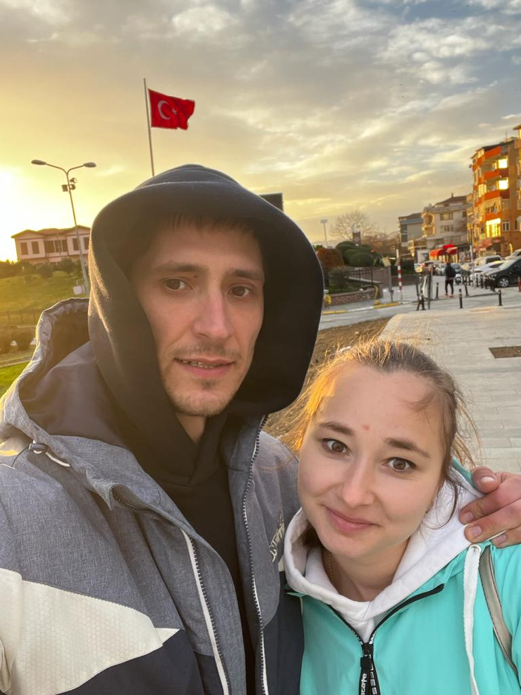

# Как я пришёл в сферу IT 

 

###### (     _На фото с женой Анастасией_)

#### Меня зовут Роман.Моя краткая биография .

 

>  После окончания школы я поступил в ТОТФиП. После успешного завершения обучения,осознал что необходимо получить высшее образоване, и поступил в ЛМЗ-ВТУЗ . 
По истечении нескольких лет работы в сфере ж/д транспорта, я размышлял о новой спецальности и заинтересовался сферой IT. В один прекрасный момент решил попробовать себя в этом направлении и начать обучение. 
 Так я оказался в НЕТОЛОГИИ.

